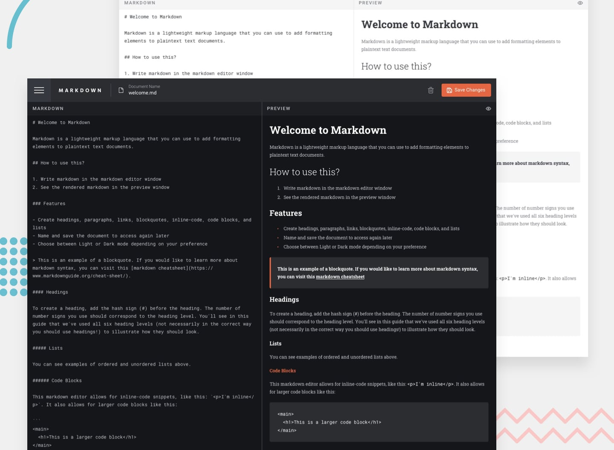

# In-browser markdown editor | Frontend Mentor | Next.js + TypeScript + Tailwind CSS + Zustand

Frontend Mentor platformundaki "Intermediate" kategorisinde yer alan "In-browser markdown editor" alıştırması.

## Demo ve Challenge'a Ait Çözüm Sayfası
* Çözüm Sayfası: https://www.frontendmentor.io/solutions/in-browser-markdown-editor-nextjs-typescript-tailwind-zustand-MBFZimxkaX
* Demo: https://markdown-editor-fm.netlify.app/

## Proje Hakkında
* Markdown belgeleri oluşturma, görüntüleme, düzenleme, silme ve indirme
* Belgeleri isimlendirip kaydedebilme ve ihtiyaç duyulduğunda erişme
* Bir belgenin markdown içeriğini düzenleyip, anında biçimlendirilmiş ön izlemesini görebilme
* Biçimlendirilmiş içeriğin tam sayfa ön izlemesini görüntüleyebilme
* Cihaz ekran boyutuna göre en uygun uygulama düzenini görüntüleme
* Sayfadaki tüm etkileşimli öğeler için hover durumlarını görebilme

## Kullanılan Teknolojiler
* Next.js
* TypeScript
* Tailwind CSS
* Zustand

## Kurulum ve Kullanım:
* Adım 1: `git clone https://github.com/gokhandemr/frontend-mentor-challenges.git`
* Adım 2: `cd frontend-mentor-challenges/in-browser-markdown-editor`
* Adım 3: `npm install`
* Adım 4: `npm run build`

## İletişim
_gkhandemir96@gmail.com_
