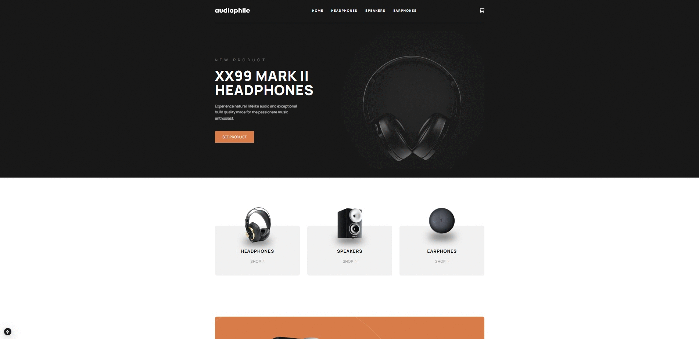

## Next.js ile Hazırlanan Audiophile E-commerce Projesi

Bu proje, kullanıcıların alışveriş sepetlerini etkin bir şekilde yönetmelerine olanak tanımakta, ödeme sayfasında anlık form doğrulama kontrolleri içermekte ve responsive tasarımı sayesinde tüm cihazlarda kullanılabilirlik sağlamaktadır.

Projeye Ait Çözüm Sayfası: https://www.frontendmentor.io/solutions/audiophile-e-commerce-website-nextjs-LFFoIHi7az

Demo: https://guru-audiophile-ecommerce.vercel.app/

---

### Özellikler

- **Alışveriş Sepeti Yönetimi:** Ürünlerin adeti değiştirilebilir veya tamamını silebilir. Ürün veya ürünlerin fiyatları, "KDV" ve "Kargo ücreti" gibi diğer etkenlere bağlı olarak anlık olarak sunulur.
- **Ödeme Sayfası Özellikleri** İnput alanları anlık olarak kontrol edilir ve hata durumunda kullanıcı uyarılır.
- **Responsive Design:** Farklı ekran boyutlarında sorunsuz çalışır.

---

### Kullandığım Teknolojiler:

- Next.js 15.
- Zustand.

---

### Kurulum ve Kullanım:

- **Adım 1: Klonlama:** `git clone https://github.com/gokhandemr/frontend-mentor-guru-challenges.git`
- **Adım 2: Proje Klasörünü Açma:** `cd frontend-mentor-guru-challenges/next.js-audiophile-ecommerce`
- **Adım 3: Npm Yükleme:** `npm install`
- **Adım 4: Çalıştırma:** `npm run start`

---

### İletişim

_gkhandemir96@gmail.com_
