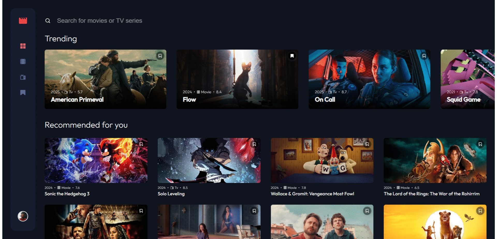

## Next.js Entertainment Web App

Bu proje, [Frontend Mentor](https://www.frontendmentor.io/) platformunda 'Advanced' kategorisindeki Entertainment Web App challenge'ı temel alınarak geliştirilmiştir.

Challange Sayfası: https://www.frontendmentor.io/solutions/entertainment-web-app-nextjs-tmdb-api-7krBzxIGAo

Demo: https://entertainment-web-app-beryl-tau.vercel.app/

---

### Proje Hakkında
* Projede kullanılan film ve dizi bilgileri, **TMDB API** yardımıyla sağlanmıştır.
* Uygulama, tüm ekran boyutlarında sorunsuz bir şekilde çalışacak şekilde tasarlanmıştır.
* Kodlama sürecinde, modüler bir bileşen yapısı tercih edilerek proje düzenli ve sürdürülebilir bir yapıya kavuşturulmuştur.
* Kullanıcılar, favori dizi ve filmlerini işaretleyebilir ve bu veriler localStorage ile cihazda saklanır.
* 404 ve diğer hata durumlarında kullanıcıya uygun mesajlar gösterilir.
* Yükleme durumlarında, kullanıcı deneyimini artırmak için skeleton ekranlar kullanılmıştır.

---

### Kullanılan Teknolojiler
- Next.js 15
- TMDb API

---

### Kurulum ve Kullanım:
- **Adım 1: Klonlama:** `git clone https://github.com/gokhandemr/frontend-mentor-advanced-challenges.git`
- **Adım 2: Proje Klasörünü Açma:** `cd frontend-mentor-advanced-challenges/next.js-entertainment-web-app/`
- **Adım 3: .env Dosyası Oluşturma:** `API_SECRET_KEY=****(TMDB API Authorization)`
- **Adım 4: Npm Yükleme:** `npm install`
- **Adım 5: Derleme ve Çalıştırma:** `npm run dev, npm run start`

---

### İletişim
_gkhandemir96@gmail.com_
