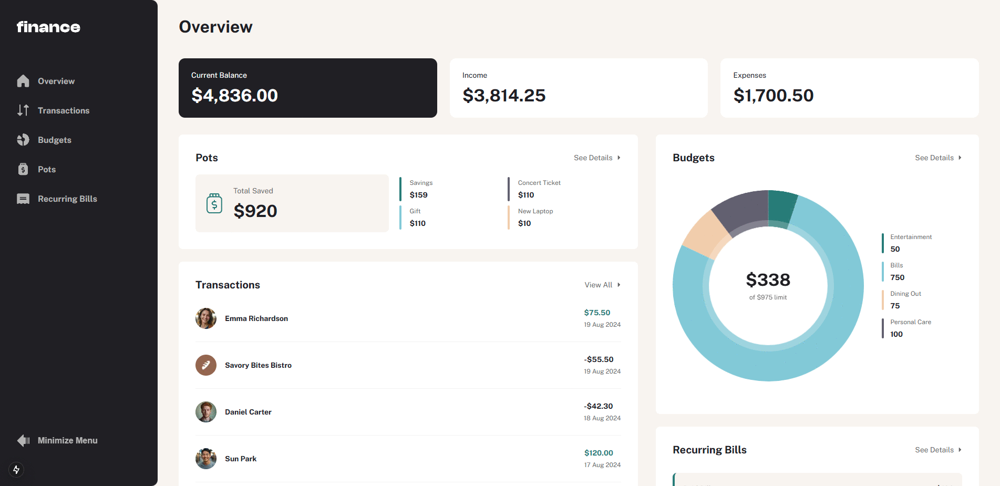

# Next.js ile Hazırlanan "Personal Finance" Projesi

Bu proje, Frontend Mentor platformunda 'Guru' kategorisindeki Entertainment Personal Finance App challenge'ı temel alınarak geliştirilmiştir.

---

## Demo ve Challenge'a Ait Çözüm Sayfası
* Challenge Sayfası: https://www.frontendmentor.io/solutions/personal-finance-app-nextjs-15-typescript-7ZqsYtzh7o
* Demo: https://personal-finance-app-lake.vercel.app/

---

## Proje Hakkında
#### Overview
* Tüm kişisel finans verilerini tek bir bakışta görüntüleme.
* Kategorileri, birikimleri ve son işlemler gibi temel bilgileri özetleme.
#### Transactions
* Tüm işlemleri listeleme ve her sayfada 10 işlem olacak şekilde sayfalandırma.
* İşlemleri arama, sıralama ve filtreleme özellikleri.
#### Budgets
* Kategori oluşturma, okuma, güncelleme ve silme işlemleri.
* Her kategori için en son yapılan üç işlemi görüntüleme ve grafik ile ilerleme durumunu görme.
#### Pots
* Para ekleme ve para çekme işlemleri.
* Grafik ile ilerleme durumunu görme.
#### Recurring Bills
* Mevcut ay için tekrarlanan faturaları ve her birinin durumunu görüntüleme.
* Yaklaşan faturaları ve ödenenleri gösterme.
* Faturaları arama ve sıralama özellikleri.
#### Duyarlı Tasarım
* Kullanıcıların cihazlarının ekran boyutuna uygun optimal düzeni görüntüleyebilmesi.
* Yükleme durumlarında, kullanıcı deneyimini artırmak için skeleton ekranlar kullanılmıştır.

---

## Kullanılan Teknolojiler
* Next.js 15
* TypeScript

---

## Kurulum ve Kullanım:
* Adım 1: `git clone https://github.com/gokhandemr/frontend-mentor-guru-challenges.git`
* Adım 2: `cd frontend-mentor-guru-challenges/next.js-personal-finance-app`
* Adım 3: `npm install`
* Adım 4: `npm run start`

---

## İletişim
_gkhandemir96@gmail.com_
