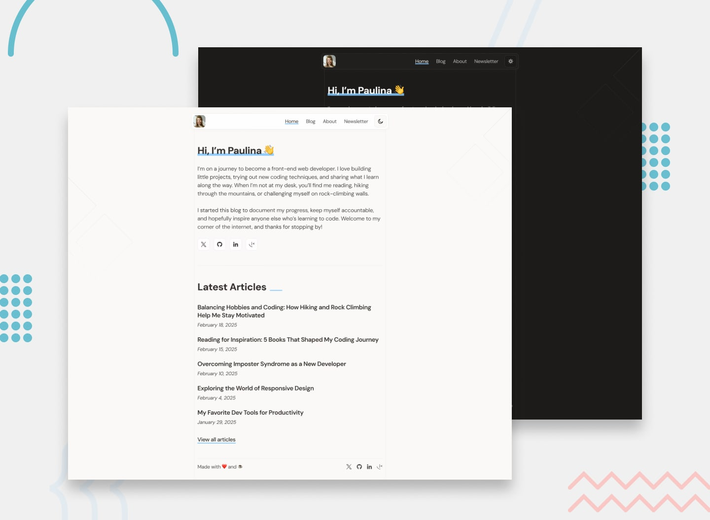

# Personal Blog | Frontend Mentor | Next.js + TypeScript + Markdown

Frontend Mentor platformundaki "Intermediate" kategorisinde yer alan "Personal Blog" alıştırması.

## Demo ve Challenge'a Ait Çözüm Sayfası
* Çözüm Sayfası: https://www.frontendmentor.io/solutions/personal-blog-with-markdown-nextjs-typescript-3LmX_oLkuJ
* Demo: https://personal-blog-markdown.vercel.app/

## Proje Hakkında
Bu proje, **Markdown** dosyalarını HTML'e dönüştürerek statik bir blog oluşturmayı amaçlamaktadır. Kullanıcılar için **açık ve koyu** tema seçenekleri sunar, ayrıca 404 sayfası, hata durumları ve yüklenme süreçleri gibi kullanıcı deneyimini iyileştiren destekleyici özellikler içerir. Proje, **responsive** tasarım ile tüm cihazlarda uyumlu bir görünüm sağlar. Kod bloklarına stil vermek için **rehype-highlight** eklentisi kullanılırken, **remark-gfm** eklentisi ile Markdown dosyalarında tabloların düzgün bir şekilde görüntülenmesi sağlanır.

## Kullanılan Teknolojiler
* Next.js
* TypeScript

## Kurulum ve Kullanım:
* Adım 1: `git clone https://github.com/gokhandemr/frontend-mentor-challenges.git`
* Adım 2: `cd frontend-mentor-challenges/personal-blog-markdown`
* Adım 3: `npm install`
* Adım 4: `npm run dev`

## İletişim
_gkhandemir96@gmail.com_