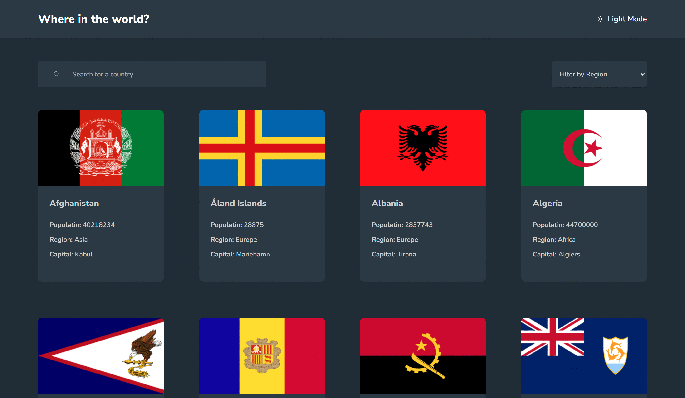

## React + Vite ile Hazırlanan Countries Uygulaması

Bu uygulama, dünya ülkeleri hakkında bilgi sunmayı amaçlayan bir web uygulamasıdır. Ülke adına göre arama yapabilir, koyu veya açık tema arasında geçiş yapabilir, kıtalara göre ülkeleri listeleyebilir ve seçilen bir ülkenin komşu ülkelerini görebilirsiniz.

Uygulama Sayfası: https://www.frontendmentor.io/solutions/rest-countries-api-with-color-theme-switcher-react-vite-5nJ_NtNT7U

Demo: https://frontend-mentor-advanced-challenges-react-countries-app.vercel.app/

---

### Özellikler
* **Ülke Araması:** Ülke adını yazarak detaylı bilgiye ulaşabilirsiniz.
* **Tema Seçimi:** Koyu veya açık tema arasından tercih yapabilirsiniz.
* **Kıta Bazlı Listeleme:** Kıtalara göre ülkeleri listeleyebilir ve inceleyebilirsiniz.
* **Komşu Ülkeler:** Seçilen ülkenin komşu ülkelerini görebilirsiniz.
* **Detaylı Bilgiler:** Her ülke için başkent, nüfus, dil, para birimi gibi detaylı bilgiler sunulur.
* **Responsive Design:** Farklı ekran boyutlarında sorunsuz çalışır.

---

### Kullandığım Teknolojiler:
- React + Vite.
- React Router DOM.
- Redux Toolkit.

---

### Kurulum ve Kullanım:
- **Adım 1: Klonlama:** `git clone https://github.com/gokhandemr/frontend-mentor-advanced-challenges.git`
- **Adım 2: Proje Klasörünü Açma:** `cd frontend-mentor-advanced-challenges/react-countries-app/`
- **Adım 3: Npm Yükleme:** `npm install`
- **Adım 4: Çalıştırma:** `npm run dev`

---

### İletişim
_gkhandemir96@gmail.com_
