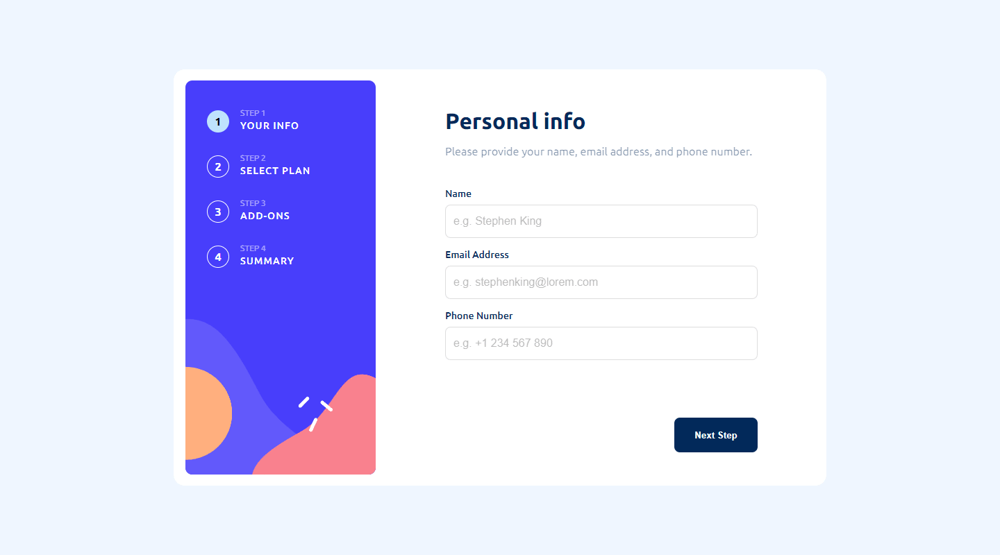

## React + Vite ile Hazırlanan Multi-Step Form Uygulaması

Bu proje, ["Frontend Mentor"](https://www.frontendmentor.io/challenges?difficulty=4) sitesine ait 4 adımdan oluşan ve her bir adımında farklı form yapılarını kullanmayı sağlayan, tasarımı olabildiğince istenilene yakın hale getirme imkanı sunan bir kodlama alıştırmasıdır.

Uygulama Sayfası: https://www.frontendmentor.io/solutions/multi-step-form-react-vite-HQln62G1yr

Demo: https://frontend-mentor-advanced-challenges-multi-step-form.vercel.app/

---

### Özellikler
* **Adım 1:** Kişisel bilgileri alan form alanı.
* **Adım 2:** Aylık veya yıllık olarak tercih edilebilen plan alanı.
* **Adım 3:** Çoklu seçim yapılabilen eklentiler alanı.
* **Adım 4:** Yapılan tüm seçimleri gösteren ve buna göre fiyat bilgisini veren özet alanı.

---

### Kullandığım Teknolojiler:
- React + Vite.
- React Router DOM.
- Zustand.

---

### Kurulum ve Kullanım:
- **Adım 1: Klonlama:** `git clone https://github.com/gokhandemr/frontend-mentor-advanced-challenges.git`
- **Adım 2: Proje Klasörünü Açma:** `cd frontend-mentor-advanced-challenges/react-multi-step-form/`
- **Adım 3: Npm Yükleme:** `npm install`
- **Adım 4: Çalıştırma:** `npm run dev`

---

### İletişim
_gkhandemir96@gmail.com_
