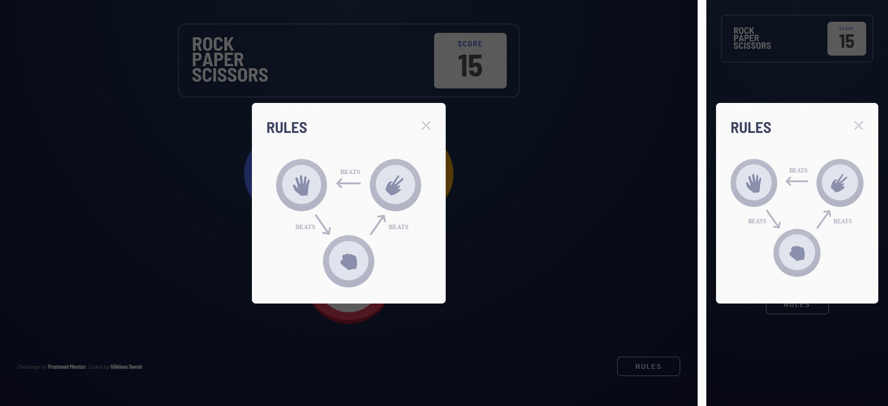

## JavaScript ile Hazırlanan "Rock Paper Scissors" Oyunu

Bu proje, klasik ve eğlenceli bir oyun olan Taş Kağıt Makas'ı bilgisayara karşı oynamanıza olanak tanır. Oyun, kullanıcıya karşı bilgisayarın rastgele seçtiği bir hamle ile oynanır.

Uygulama Sayfası: https://www.frontendmentor.io/solutions/rock-paper-scissors-game-html-css-javascript-jYkqxW79wK

Demo: https://frontend-mentor-advanced-challenges-rock-paper-scissors.vercel.app/

---

### Özellikler
* **Kazanma, Kaybetme ve Beraberlik Durumları:** Oyunun sonucunu ekranda gösterir ve score bilgisini kaydeder.
* **Responsive Design:** Farklı ekran boyutlarında sorunsuz çalışır.

---

### Kullandığım Teknolojiler:
- JavaScript, HTML ve CSS.

---

### Bu Projede Yaptıklarım:
- İstenilen tasarımı bilgisayar, telefon ve tablet gibi tüm cihazlarda kullanıma uygun olacak şekilde yerine getirdim.
- Seçilen nesneye göre galibiyet-yenilgi-beraberlik durumlarını veren oyun kurallarını JavaScript tarafında yazdım.
- Galibiyet, beraberlik veya yenilgi durumlarını "score" alanına puan olarak yansıttım ve bunu istemcinin localStorage bölümüne ekledim.
- Tasarımın "Pixel Perfect" olmasına özen gösterdim.

---

### Kurulum ve Kullanım:
- **Adım 1: Klonlama:** `git clone https://github.com/gokhandemr/frontend-mentor-advanced-challenges.git`
- **Adım 2: Proje Klasörünü Açma:** `cd frontend-mentor-advanced-challenges/rock-paper-scissors/`
- **Çalıştırma:** `Oyunu "live-server" gibi herhangi bir yerel sunucu eklentisini yardımıyla açabilirsiniz.`

---

### İletişim
_gkhandemir96@gmail.com_
