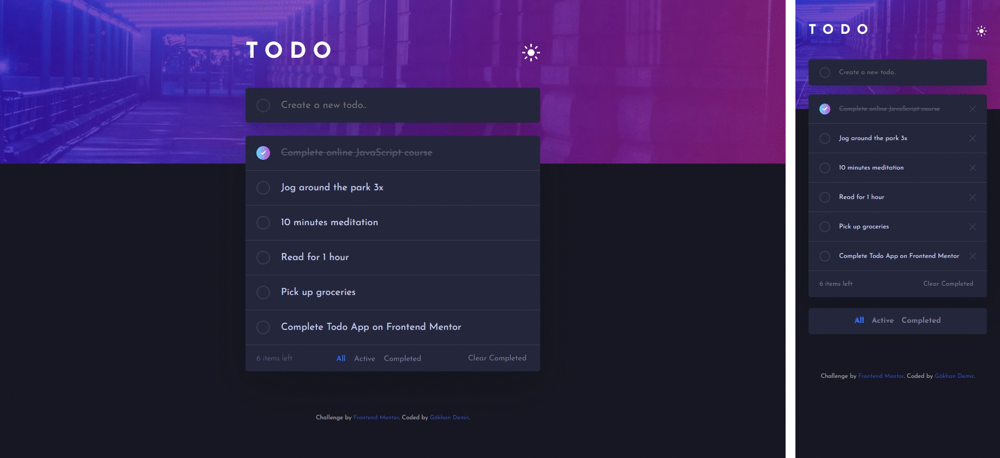

# Todo App  
  
Bu proje, [Frontend Mentor](https://www.frontendmentor.io/challenges/todo-app-Su1_KokOW) sitesindeki **"Todo App"** meydan okumasının bir çözümüdür.  

**Çözüm Sayfası:** [Solution](https://www.frontendmentor.io/solutions/todo-app-html-css-javascript)  
**Demo:** [Todo App](https://frontendmentor-challenge-todo-app-pearl.vercel.app/)  

---  

## Kullanılan Teknolojiler  
- HTML  
- CSS  
- JavaScript  

---  

## Projede Gerçekleştirdiklerim  
* İstenilen tasarımı bilgisayar, telefon ve tablet gibi tüm cihazlarda kullanıma uygun olacak şekilde yerine getirdim.
* Tasarımın "Pixel Perfect" olmasına özen gösterdim.
* Listede bulunan görevlere "tamamlandı" ve "sil" fonksiyonları ekledim.
* Görevlerin tümünü, tamamlanmış olanları ve aktif olanları gösterecek şekilde filtreledim.
* Tamamlanmış olan görevlerin tümünün silinmesini sağlayan buton ekledim.
* Açık ve koyu tema seçenekleri ekledim.

---  

## 📩 İletişim  
_gkhandemir96@gmail.com_